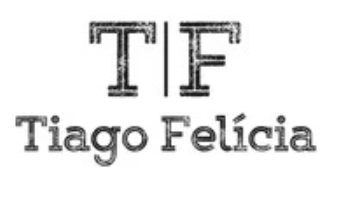

# Tiago Felícia — Simuladores de Energia para Portugal

**[www.tiagofelicia.pt](https://www.tiagofelicia.pt)** — Ferramentas **gratuitas, independentes e transparentes** para analisar o mercado de energia em Portugal: simuladores de tarifários de eletricidade e gás natural, autoconsumo solar fotovoltaico, dashboards do mercado ibérico (OMIE/OMIP) e mapas europeus de preços e produção.

Todo o processamento corre **localmente no browser** — os dados de consumo do utilizador (ficheiros da E-Redes) nunca são enviados para nenhum servidor.

---

## ⚡ Simuladores

| Ferramenta | Descrição |
|---|---|
| [Simulador de Eletricidade](https://www.tiagofelicia.pt/eletricidade-tiagofelicia) | Compara tarifários fixos, indexados à média e quarto-horários/dinâmicos. Aceita o diagrama de carga da E-Redes (`.xlsx`) para cálculo hora a hora, analisa a potência contratada e gera links de partilha. |
| [Simulador de Gás Natural](https://www.tiagofelicia.pt/gas-natural-tiagofelicia) | Compara tarifários de gás fixos e indexados ao MIBGAS, por escalão de consumo, com todas as taxas e impostos. |
| [Simulador de Autoconsumo Solar](https://www.tiagofelicia.pt/autoconsumo-tiagofelicia) | Estima produção (perfis PVGIS), autoconsumo, excedente e payback; permite comparar propostas comerciais. |
| [Autoconsumo em Excel](https://www.tiagofelicia.pt/simulador-autoconsumo-excel) | Versão em folha de cálculo, para uso offline. |

## 📊 Mercado e dados

- [OMIE Diário](https://www.tiagofelicia.pt/omie-diario) · [OMIE Histórico](https://www.tiagofelicia.pt/omie) (desde 2010) · [OMIP Futuros](https://www.tiagofelicia.pt/omip) · [Preços Horários](https://www.tiagofelicia.pt/precos-horarios)
- [Balanço Energético vs OMIE](https://www.tiagofelicia.pt/balanco-omie) · [Balanço Energético Histórico](https://www.tiagofelicia.pt/balanco-historico)
- [Mapa de Preços da Europa](https://www.tiagofelicia.pt/europe-prices) (ENTSO-E, 47 zonas) · [Mapa de Produção](https://www.tiagofelicia.pt/europe-generation) · [Balanço Energético Europa](https://www.tiagofelicia.pt/europe-balance)

## 📚 Regulação e recursos

Tarifas de Acesso às Redes (TAR), Tarifa Social, tarifas reguladas (CUR), períodos horários BTN, perfis de perdas, [fórmulas dos tarifários indexados](https://www.tiagofelicia.pt/formulas-tarifarios-indexados), [como ler a fatura](https://www.tiagofelicia.pt/como-ler-fatura), [glossário energético](https://www.tiagofelicia.pt/glossario) e [calendário energético](https://www.tiagofelicia.pt/calendario-energetico).

## 🔄 Dados e automação

Os dados de mercado (preços OMIE/OMIP, produção REN, mapas europeus ENTSO-E) vivem num repositório dedicado — **[dados-energia](https://github.com/tiagofelicia/dados-energia)** — e são servidos publicamente em **[dados.tiagofelicia.pt](https://dados.tiagofelicia.pt)**, com licença CC BY 4.0 e CORS aberto. A atualização é feita por GitHub Actions a partir das fontes oficiais (OMIE, OMIP, REN, ERSE, E-Redes, ENTSO-E, Energy-Charts). Ver também o [`llms.txt`](llms.txt) para um índice orientado a máquinas.

## 💻 Tecnologias

HTML5, CSS3 e JavaScript (ES6+) puros, sem backend — alojado em GitHub Pages. Bibliotecas: [Highcharts](https://www.highcharts.com/) (gráficos), [SheetJS](https://sheetjs.com/) e [ExcelJS](https://github.com/exceljs/exceljs) (Excel no browser), [Leaflet](https://leafletjs.com/) (mapas). Pipelines de dados em Python (pandas).

## ❤️ Apoiar o projeto

Se estas ferramentas o ajudaram a poupar, considere [apoiar o projeto](https://www.tiagofelicia.pt/apoio):

- [☕ Buy Me a Coffee](https://buymeacoffee.com/tiagofelicia)
- [🅿️ PayPal](https://www.paypal.com/donate?hosted_button_id=W6KZHVL53VFJC)

## 📧 Contacto

**Tiago Felícia** — [www.tiagofelicia.pt/contacto](https://www.tiagofelicia.pt/contacto)

## 📄 Licença

Código deste repositório: todos os direitos reservados — ver [LICENSE.txt](LICENSE.txt). Os dados publicados em [dados.tiagofelicia.pt](https://dados.tiagofelicia.pt) provêm de fontes públicas oficiais e estão sob CC BY 4.0; ao citar, indique *"Simulador de Tarifários de Tiago Felícia"* com link para a página utilizada.

*© 2022–2026 Tiago Felícia.*
